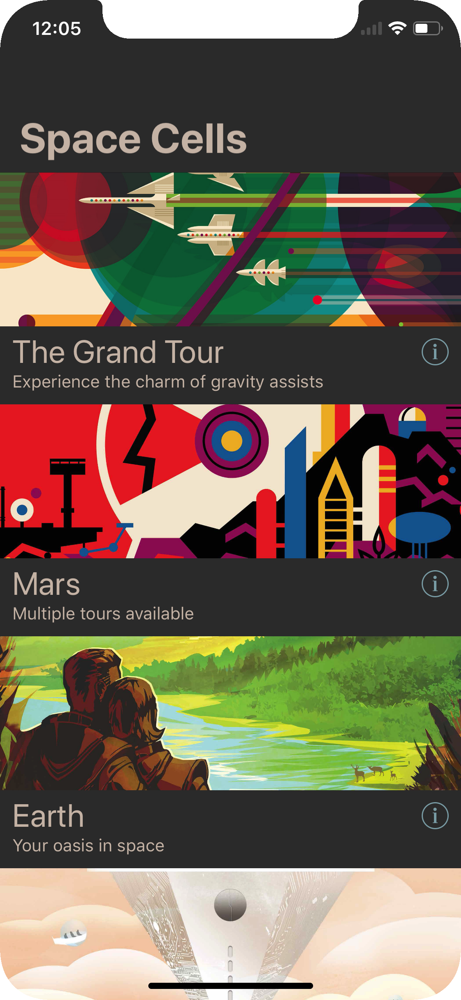
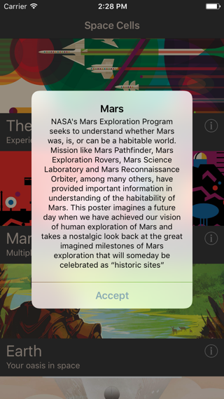
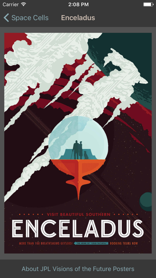

# Space Cells 
[](https://codebeat.co/projects/github-com-emenegro-space-cells-ios-master) [](https://travis-ci.org/emenegro/space-cells-ios)


Exercising collection view **loading**, **configuration** and **interaction** on iOS VIPER architecture.

The motivation is to explore the implementation of a mechanism to allow the interaction with components inside cells without involving the view.

## `Collectionable` protocols

These are three.

### `Collectionable`

A protocol to describe the **loading** and **interaction** of a collection view like `UITableView` or `UICollectionView`.

```Swift
protocol Collectionable {
    associatedtype Item: CollectionableViewModel
    func items() -> [Section: [Item]]
    func numberOfSections() -> Section
    func numberOfRows(inSection section: Section) -> Int
    func viewModelForRowAtIndexPath<Item>(indexPath: IndexPath) -> Item?
    func rowSelectedAtIndexPath(indexPath: IndexPath)
}
```

### `CollectionableViewModel`

A type describing a view model to be **loaded** in a cell of a collection view.

```Swift
protocol CollectionableViewModel {
    func onRowSelected()
}
```

Its only method is the one related with the **interaction**.

### `CollectionableViewModelCellConfigurable`

The last protocol is that which describes a cell that can be **configured** with a view model conforming to `CollectionableViewModel`.

```Swift
protocol CollectionableViewModelCellConfigurable {
    associatedtype CollectionableViewModelType: CollectionableViewModel
    func configure(viewModel: CollectionableViewModelType?)
}
```

Let's see how to use this.

## Example app
The example app is composed of three views:

- The main view, a list of space posters.
- An information view of each poster shown when tapping the information button inside the cell.
- A detail view that shows the whole poster when tapping the cell.

  

Having an usual VIPER module, using `Collectionable` protocols is easy.

### Step 1

First of all, we have to create a view model conforming to `CollectionableViewModel`:

```Swift
struct PosterCellViewModel {
    let title: String
    let subtitle: String
    let imageName: String
    let selectionBlock: () -> Void
    let infoButtonSelectionBlock: () -> Void
}
```

It has the common data to print on the cell and a couple of closures to invoke when tapping the cell (showing the detail) and the information button (showing the info alert). With a protocol extension we invoke the selection block when the cell is tapped.

```Swift
extension PosterCellViewModel: CollectionableViewModel {
    func onRowSelected() {
        selectionBlock()
    }
}
```

### Step 2

The `Presenter` manages these view models so it has to conform to `Collectionable` protocol:

```Swift
extension ListPresenterImpl: Collectionable {   
    func items() -> [Section : [PosterCellViewModel]] {
        return [0: viewModels]
    }
}
```

We have to implement only the method related with the items, the others are implemented by default with a protocol extension.

### Step 3

Now we create a cell conforming to `CollectionableViewModelCellConfigurable`.

```Swift
extension VerticalPosterCell: CollectionableViewModelCellConfigurable {
    func configure(viewModel: PosterCellViewModel?) {
        titleLabel.text = viewModel?.title
        subtitleLabel.text = viewModel?.subtitle
        configureImage(imageName: viewModel?.imageName)
    }
}
```

### Step 4

Being our `Presenter` the `Collectionable` we have to bind it to the `View` to load and configure the collection view. Create a reference to the collectionable:

```Swift
let tableViewCollectionable: AnyCollectionable<PosterCellViewModel>
```

After that you have to implement the collection view methods and get all the info from the collectionable:

```Swift
extension ListViewController: UITableViewDataSource {
    
    func numberOfSections(in tableView: UITableView) -> Int {
        return tableViewCollectionable.numberOfSections()
    }
    
    func tableView(_ tableView: UITableView, numberOfRowsInSection section: Int) -> Int {
        return tableViewCollectionable.numberOfRows(inSection: section)
    }
    
    func tableView(_ tableView: UITableView, cellForRowAt indexPath: IndexPath) -> UITableViewCell {
        let viewModel: PosterCellViewModel? = tableViewCollectionable.viewModelForRowAtIndexPath(indexPath: indexPath)
        let cell: VerticalPosterCell = tableView.dequeueReusableCell(forIndexPath: indexPath)
        cell.configure(viewModel: viewModel)
        return cell
    }
}

extension ListViewController: UITableViewDelegate {    
    func tableView(_ tableView: UITableView, didSelectRowAt indexPath: IndexPath) {
        tableViewCollectionable.rowSelectedAtIndexPath(indexPath: indexPath)
    }
}
```

### Step 5 (the last one)

The last step consists of binding the `Collectionable` (our `Presenter`) to the `View`, in our `ModuleFactory`:

```Swift
let presenter = ListPresenterImpl(interactor: interactor, router: router)
let tableViewCollectionable = AnyCollectionable(presenter)
let view = ListViewController(presenter: presenter, tableViewCollectionable: tableViewCollectionable)        
```

As you note the collectionable is an instance of `AnyCollectionable`, as we need to erase the associated type.

#### A final note

While I develop this exercise the first thought that came to my mind was to give  `Collectionable` the ability to configure the cell, making the protocol generic with two associated types, the current `Item` and other called `Cell`, but that means that my `Presenter` would know about the view implementation details (the type of the cell), and that brokes with the separation of responsabilities between the `View` and the `Presenter`.

## //TODO:
- Allow loading of multiple cell types.
- UI testing.
- Pull requests and comments are welcomed!

## Acknowledgements
- Application icon from [Wikimedia Commons](https://commons.wikimedia.org/wiki/File%3ACreative-Tail-rocket.svg).
- Posters from [JPL Visions of the Future](http://www.jpl.nasa.gov/visions-of-the-future/).
- This apps uses ['Reusable' extensions](https://medium.com/@gonzalezreal/ios-cell-registration-reusing-with-swift-protocol-extensions-and-generics-c5ac4fb5b75e#.mxlpvb6h0) by Guille González (adapted to Swift 3).
- Further reading about protocols, generics, associated types and type erasure: [Swift: Associated Types series](http://www.russbishop.net/swift-associated-types) by Russ Bishop.

## License
This code is licensed under the [MIT License](LICENSE).
