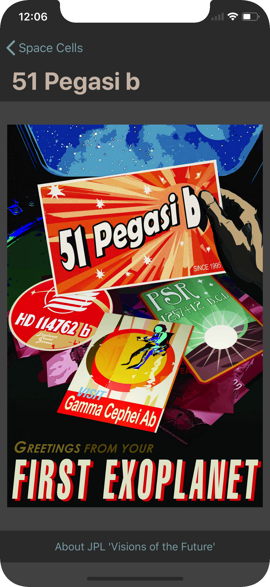

# Space Cells

Exercising collection view **loading**, **configuration** and **interaction** on iOS VIPER architecture.

The motivation is to explore the implementation of a mechanism tho allow the interaction with components inside cells without involving the view.

## Example app
This app is composed of three views:

- The main view showing a list of space posters.
- An information view shown when tapping information button.
- A detail view that shows the whole poster when tapping the cell.

  

## //TODO:
- **Allow loading of multiple cell types.**
- UI testing.
- Pull requests and comments are welcomed!

## Acknowledgements
- Application icon from [Wikimedia Commons](https://commons.wikimedia.org/wiki/File%3ACreative-Tail-rocket.svg).
- Posters from [JPL Visions of the Future](http://www.jpl.nasa.gov/visions-of-the-future/).
- This apps uses ['Reusable' extensions](https://medium.com/@gonzalezreal/ios-cell-registration-reusing-with-swift-protocol-extensions-and-generics-c5ac4fb5b75e#.mxlpvb6h0) by Guille González (adapted to Swift 3).

## License
This code is licensed under the [MIT License](LICENSE).
